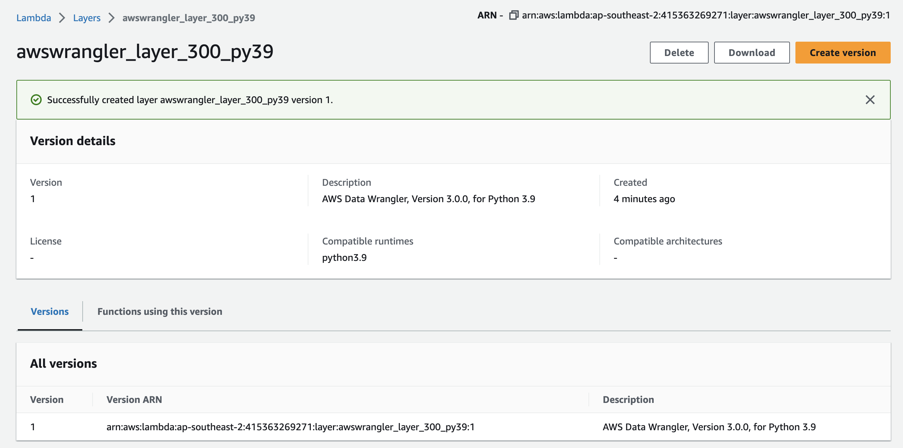

# AWS Lambda function

## Lab 1: AWS Lambda Function Triggering

### Lab Objective

- **Lab**: triggering an AWS Lambda function when a new file arrives in an S3 bucket
  - **Task**: configure an S3 bucket to automatically trigger a Lambda function whenever a new file is written to the bucket.
    - In the Lambda function, an open source Python library called `AWS Data Wrangler`, created by AWS Professional Services to simplify common ETL tasks when working in an AWS environment, is used to convert a CSV file into Parquet format, and then update the AWS Glue Data Catalog.

### Creating a `Lambda layer` containing `AWS Data Wrangler` library

- `Lambda layers` allow your Lambda function to bring in additional code, packaged as a .zip file.
- By creating a Lambda layer for the AWS Data Wrangler library, we can use AWS Data Wrangler in any of our Lambda functions just by ensuring this Lambda layer is attached to the function.
  - AWS Data Wrangler library in GitHub at [https://github.com/awslabs/aws-data-wrangler/releases](https://github.com/awslabs/aws-data-wrangler/releases). Under **Assets**, download the awswrangler-layer-3.0.0-py3.9.zip file to your local drive.
  - In the top search bar of the **AWS console**, search for and select the **Lambda** service.
  - In the left-hand menu, under **Additional Resources**, select **Layers**, and then click on Create layer.
  - For **Compatible runtimes** choose `optional`, select Python 3.9 and then click Create.
    

### Creating new Amazon S3 buckets

- It is common for data lake to have multiple zones for the data to move through.
- _Note_: ensure the bucket is in the same region with the Lambda function
  - **Landing Zone** (for ingestion of raw files) (e.g. `upskills-landing-zone`)
  - **Clean zone** (for files that have undergone initial processing and optimization) (e.g. `upskills-clean-zone`)

### Creating an IAM policy and role for Lambda function

- For this project, ensure that our Lambda function has the following permissions:
  - Read our source S3 bucket
  - Write to our target S3 bucket (for example, dataeng-clean-zone-<initials>)
  - Write logs to Amazon CloudWatch
  - Access to all Glue API actions (to enable the creation of new databases and tables)
- To create a new AWS IAM role with these permissions, follow these steps:
  - Step 1: From the Services dropdown, select the **IAM service**, and in the left-hand menu, select **Policies** and then click on **Create policy**.
    - By default, the Visual editor tab is selected, so change to the **JSON** tab.
- Step 2: copy the [S3, Cloud Watch, & Glue Policy](./lab01/DataEngLambdaS3CWGluePolicy.json) to the **JSON** tab
